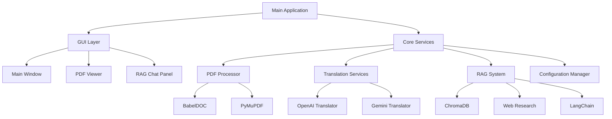

# 🏗️ PDFusion Architecture

This document describes the technical architecture and design patterns used in PDFusion.

## 📊 System Overview



## 🏛️ Core Components

### 1. **GUI Layer** (`src/desktop_pdf_translator/gui/`)
- **Main Window**: Primary application interface
- **PDF Viewer**: Document display and navigation
- **RAG Chat Panel**: Q&A interface
- **Worker Threads**: Async processing

### 2. **PDF Processing** (`src/desktop_pdf_translator/processors/`)
- **PDF Processor**: Core document processing pipeline
- **Layout Preservation**: BabelDOC integration
- **Content Extraction**: Text, images, tables, equations
- **Event System**: Progress tracking and notifications

### 3. **Translation Services** (`src/desktop_pdf_translator/translators/`)
- **Base Translator**: Abstract interface
- **OpenAI Translator**: GPT-4 integration
- **Gemini Translator**: Google Gemini integration
- **Factory Pattern**: Service selection and instantiation

### 4. **RAG System** (`src/desktop_pdf_translator/rag/`)
- **Document Intelligence**: PDF content analysis
- **Vector Database**: ChromaDB for embeddings
- **Web Research**: Academic search integration
- **Q&A Chain**: LangChain-based processing

### 5. **Configuration** (`src/desktop_pdf_translator/config/`)
- **Settings Manager**: TOML-based configuration
- **Environment Variables**: API keys and runtime settings
- **User Preferences**: Persistent user settings

## 🔄 Data Flow

### Translation Pipeline
```
1. PDF Upload → 2. Content Extraction → 3. Translation → 4. Layout Reconstruction → 5. Output Generation
```

### RAG Pipeline
```
1. Document Processing → 2. Embedding Generation → 3. Vector Storage → 4. Query Processing → 5. Response Generation
```

## 🎯 Design Patterns

### 1. **Factory Pattern**
- Translation service selection
- Configuration provider instantiation

### 2. **Observer Pattern**
- Progress tracking
- Event notifications
- UI updates

### 3. **Strategy Pattern**
- Different translation services
- Various PDF processing strategies

### 4. **Adapter Pattern**
- External API integration
- Service abstraction

## 🔧 Technology Stack

### Core Technologies
- **Python 3.11+**: Primary language
- **PySide6**: GUI framework
- **Pydantic**: Data validation and settings
- **AsyncIO**: Asynchronous processing

### PDF Processing
- **BabelDOC**: Layout preservation
- **PyMuPDF**: PDF manipulation
- **Camelot**: Table extraction
- **PDFPlumber**: Advanced text extraction

### AI/ML Stack
- **OpenAI API**: GPT-4 translation
- **Google Gemini**: Alternative translation
- **ChromaDB**: Vector database
- **LangChain**: RAG framework
- **Sentence Transformers**: Embeddings

### Web Research
- **aiohttp**: Async HTTP client
- **BeautifulSoup**: HTML parsing
- **Google Search API**: Web search
- **Scholarly**: Academic paper search

## 📦 Module Dependencies

```
desktop_pdf_translator/
├── __init__.py
├── main.py                 # Application entry point
├── config/                 # Configuration management
│   ├── __init__.py
│   ├── manager.py         # Settings manager
│   └── models.py          # Configuration models
├── gui/                   # User interface
│   ├── __init__.py
│   ├── main_window.py     # Main application window
│   ├── widgets.py         # Custom UI components
│   └── worker.py          # Background processing
├── processors/            # PDF processing
│   ├── __init__.py
│   ├── processor.py       # Core processing pipeline
│   ├── events.py          # Event system
│   └── exceptions.py      # Custom exceptions
├── translators/           # Translation services
│   ├── __init__.py
│   ├── base.py           # Abstract base class
│   ├── factory.py        # Service factory
│   ├── openai_translator.py
│   └── gemini_translator.py
├── rag/                  # RAG system
│   ├── __init__.py
│   ├── document_processor.py
│   ├── vector_store.py
│   ├── web_research.py
│   └── qa_chain.py
└── utils/                # Utility functions
    ├── __init__.py
    ├── logging.py
    └── helpers.py
```

## 🔒 Security Considerations

### API Key Management
- Environment variables for sensitive data
- No hardcoded credentials
- Secure configuration file handling

### Data Privacy
- Local processing when possible
- Minimal data transmission
- User consent for web research

### Error Handling
- Graceful degradation
- Comprehensive logging
- User-friendly error messages

## 🚀 Performance Optimizations

### Async Processing
- Non-blocking UI operations
- Concurrent API calls
- Background processing

### Memory Management
- Efficient PDF handling
- Vector database optimization
- Resource cleanup

### Caching
- Translation results
- Embedding cache
- Configuration cache

## 🔮 Extensibility

### Plugin Architecture
- Modular translator services
- Configurable processing pipeline
- Custom UI components

### API Integration
- RESTful service endpoints
- Webhook support
- External tool integration

### Internationalization
- Multi-language UI support
- Localized error messages
- Cultural adaptations
